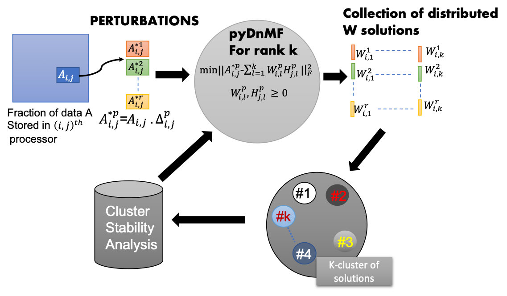

# [pyDNMFk: Python Distributed Non Negative Matrix Factorization with determination of hidden features](https://github.com/lanl/pyDNMFk)


<div align="center", style="font-size: 50px">

[](https://github.com/lanl/Distributed_pyNMFk/actions/workflows/ci_test.yml/badge.svg?branch=main) [](https://img.shields.io/badge/License-BSD%203--Clause-blue.svg) [](https://img.shields.io/badge/python-v3.7.1-blue) [](https://zenodo.org/badge/355419372.svg)

</div>

<br>

[pyDNMFk](https://github.com/lanl/pyDNMFk) is a software package for applying non-negative matrix factorization in a distrubuted fashion to large datasets. It has the ability to minimize the difference between reconstructed data and the original data through various norms (Frobenious, KL-divergence).  Additionally, the Custom Clustering algorithm allows for automated determination for the number of Latent features 

<hr/>


## Features:

* Utilization of MPI4py for distributed operation.
* Distributed NNSVD and SVD initiaizations.
* Distributed Custom Clustering algorithm for estimating automated latent feature number (k) determination.
* Objective of minimization of KL divergence/Frobenius norm. 
* Optimization with multiplicative updates, BCD, and HALS. 



Overview of the pyDNMFk workflow implementation.
## Installation:

On a desktop machine
```
git clone https://github.com/lanl/pyDNMFk.git
cd pyDNMFk
conda create --name pyDNMFk python=3.7.1 openmpi mpi4py
source activate pyDNMFk
python setup.py install
```

<hr/>

On a server
```
git clone https://github.com/lanl/pyDNMFk.git
cd pyDNMFk
conda create --name pyDNMFk python=3.7.1 
source activate pyDNMFk
module load <openmpi>
pip install mpi4py
python setup.py install
```

## Prerequisites:
* conda
* numpy>=1.2
* matplotlib
* MPI4py
* scipy
* h5py

## Documentation

You can find the documentation [here](https://lanl.github.io/pyDNMFk/). 


## Usage
We provide a sample dataset that can be used for estimation of k:
```python
'''Imports block'''
import pyDNMFk.config as config
config.init(0)
from pyDNMFk.pyDNMFk import *
from pyDNMFk.data_io import *
from pyDNMFk.dist_comm import *
from scipy.io import loadmat
from mpi4py import MPI
comm = MPI.COMM_WORLD
args = parse()  


'''parameters initialization block'''

# Data Read here
args.fpath = 'data/'
args.fname = 'wtsi'  
args.ftype = 'mat'
args.precision = np.float32

#Distributed Comm config block
p_r, p_c = 4, 1  

#NMF config block
args.norm = 'kl'
args.method = 'mu'
args.init = 'nnsvd'
args.itr = 5000
args.verbose = True

#Cluster config block
args.start_k = 2 
args.end_k = 5
args.sill_thr = 0.9

#Data Write
args.results_path = 'results/'


'''Parameters prep block'''
comms = MPI_comm(comm, p_r, p_c)
comm1 = comms.comm
rank = comm.rank
size = comm.size
args.size, args.rank, args.comm, args.p_r, args.p_c = size, rank, comms, p_r, p_c
args.row_comm, args.col_comm, args.comm1 = comms.cart_1d_row(), comms.cart_1d_column(), comm1
A_ij = data_read(args).read().astype(args.precision)

nopt = PyNMFk(A_ij, factors=None, params=args).fit()
print('Estimated k with NMFk is ',nopt)
```

Alternately, you can also run from test folder in command line as:
```bash
mpirun -n 4 python main.py --p_r=2 --p_c=2 --process='pyDNMFk' --k=2 --fpath='../data/' --ftype='mat' --fname='swim' --init='rand' --itr=5000 --norm='kl' --method='mu' --results_path='../results/' --perturbations=20 --noise_var=0.015 --start_k=2 --end_k=18 --sill_thr=.6 --sampling='uniform'
```

See the resources for more use cases.
<hr/>

## Benchmarking


Figure: Scaling benchmarks for 10 iterations for Frobenius norm based MU updates with MPI
 operations for i) strong and ii) weak scaling and  Communication vs computation 
operations for iii) strong and iv) weak scaling. 

## Scalability


## Authors:

* [Manish Bhattarai](mailto:ceodspspectrum@lanl.gov) - Los Alamos National Laboratory
* [Ben Nebgen](mailto:bnebgen@lanl.gov) - Los Alamos National Laboratory
* [Erik Skau](mailto:ewskau@lanl.gov) - Los Alamos National Laboratory
* [Maksim Eren](mailto:maksim@lanl.gov) - Los Alamos National Laboratory
* [Gopinath Chennupati](mailto:gchennupati@lanl.gov) - Los Alamos National Laboratory
* [Raviteja Vangara](mailto:rvangara@lanl.gov) - Los Alamos National Laboratory
* [Hristo Djidjev](mailto:djidjev@lanl.gov) - Los Alamos National Laboratory
* [John Patchett](mailto:patchett@lanl.gov) - Los Alamos National Laboratory
* [Jim Ahrens](mailto:ahrens@lanl.gov) - Los Alamos National Laboratory
* [Boian Alexandrov](mailto:boian@lanl.gov) - Los Alamos National Laboratory

## Citation:

```@misc{rw2019timm,
  author = {Manish Bhattarai,Ben Nebgen,Erik Skau,Maksim Eren,Gopinath Chennupati,Raviteja Vangara,Hristo Djidjev,John Patchett,Jim Ahrens,Boian ALexandrov},
  title = {pyDNMFk: Python Distributed Non Negative Matrix Factorization},
  year = {2021},
  publisher = {GitHub},
  journal = {GitHub repository},
  doi = {10.5281/zenodo.4722448},
  howpublished = {\url{https://github.com/lanl/pyDNMFk}}
}
```
```@inproceedings{bhattarai2020distributed,
  title={Distributed Non-Negative Tensor Train Decomposition},
  author={Bhattarai, Manish and Chennupati, Gopinath and Skau, Erik and Vangara, Raviteja and Djidjev, Hristo and Alexandrov, Boian S},
  booktitle={2020 IEEE High Performance Extreme Computing Conference (HPEC)},
  pages={1--10},
  year={2020},
  organization={IEEE}
}
```
```@article{chennupati2020distributed,
  title={Distributed non-negative matrix factorization with determination of the number of latent features},
  author={Chennupati, Gopinath and Vangara, Raviteja and Skau, Erik and Djidjev, Hristo and Alexandrov, Boian},
  journal={The Journal of Supercomputing},
  pages={1--31},
  year={2020},
  publisher={Springer}
}
```
## Acknowledgments:
Los Alamos National Lab (LANL), T-1

## Copyright Notice:

© (or copyright) 2020. Triad National Security, LLC. All rights reserved.
This program was produced under U.S. Government contract 89233218CNA000001 for Los Alamos
National Laboratory (LANL), which is operated by Triad National Security, LLC for the U.S.
Department of Energy/National Nuclear Security Administration. All rights in the program are
reserved by Triad National Security, LLC, and the U.S. Department of Energy/National Nuclear
Security Administration. The Government is granted for itself and others acting on its behalf a
nonexclusive, paid-up, irrevocable worldwide license in this material to reproduce, prepare
derivative works, distribute copies to the public, perform publicly and display publicly, and to permit
others to do so.

## License:

This program is open source under the BSD-3 License.
Redistribution and use in source and binary forms, with or without
modification, are permitted provided that the following conditions are met:

1. Redistributions of source code must retain the above copyright notice, this
   list of conditions and the following disclaimer.

2. Redistributions in binary form must reproduce the above copyright notice,
   this list of conditions and the following disclaimer in the documentation
   and/or other materials provided with the distribution.

3. Neither the name of the copyright holder nor the names of its
   contributors may be used to endorse or promote products derived from
   this software without specific prior written permission.

THIS SOFTWARE IS PROVIDED BY THE COPYRIGHT HOLDERS AND CONTRIBUTORS "AS IS"
AND ANY EXPRESS OR IMPLIED WARRANTIES, INCLUDING, BUT NOT LIMITED TO, THE
IMPLIED WARRANTIES OF MERCHANTABILITY AND FITNESS FOR A PARTICULAR PURPOSE ARE
DISCLAIMED. IN NO EVENT SHALL THE COPYRIGHT HOLDER OR CONTRIBUTORS BE LIABLE
FOR ANY DIRECT, INDIRECT, INCIDENTAL, SPECIAL, EXEMPLARY, OR CONSEQUENTIAL
DAMAGES (INCLUDING, BUT NOT LIMITED TO, PROCUREMENT OF SUBSTITUTE GOODS OR
SERVICES; LOSS OF USE, DATA, OR PROFITS; OR BUSINESS INTERRUPTION) HOWEVER
CAUSED AND ON ANY THEORY OF LIABILITY, WHETHER IN CONTRACT, STRICT LIABILITY,
OR TORT (INCLUDING NEGLIGENCE OR OTHERWISE) ARISING IN ANY WAY OUT OF THE USE
OF THIS SOFTWARE, EVEN IF ADVISED OF THE POSSIBILITY OF SUCH DAMAGE.


